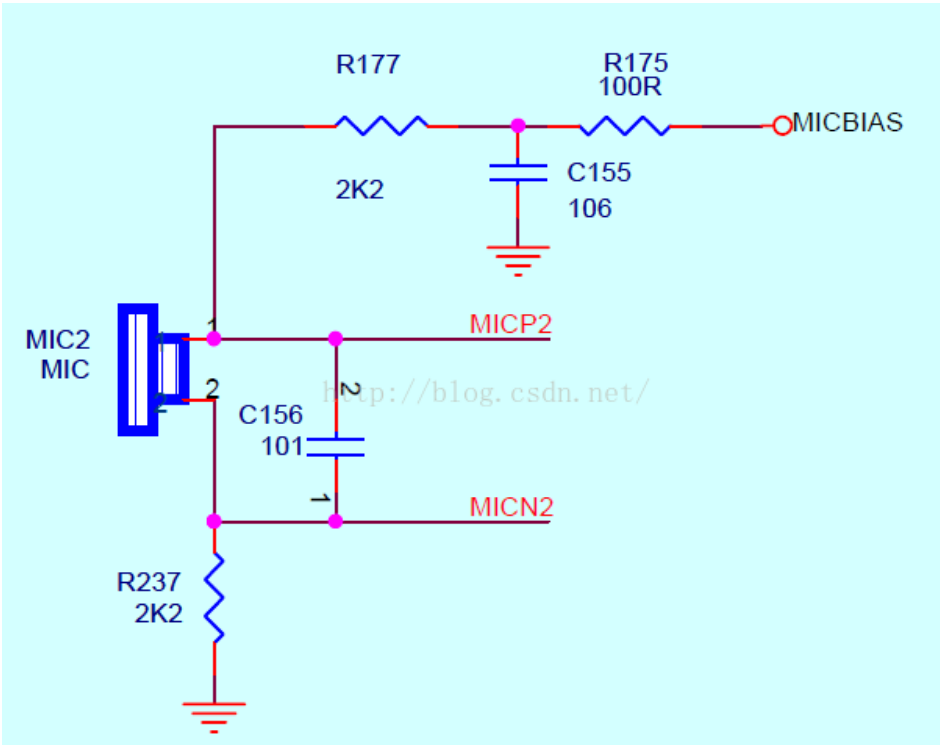

## mic 的工作原理

https://blog.csdn.net/xujianqun/article/details/6661947

1. 先看MIC电路连接

这是个差分输入的例子，MICP2和MICN2是一对差分信号，经过C156的滤波，输入到MIC两端

MIC两引脚分别是到地和供电，上图的R177参数就关系到MIC输入的灵敏度

2. 电阻R177影响灵敏度分析

MICBIAS是提供MIC的偏置电压，其大小一般是由codec的内部寄存器配置的，比如为0.6AVDD；

显然，电阻R177越大，通过R177的电流就越小，输入到MIC的电流就变化了。

这里先讲到MIC输入电流受R177电阻参数影响，下面分析下MIC工作原理

3. MIC工作原理分析

MIC内部设计，可以简单理解为一个电容，电容的一端是固定的，另一端是可动的，两端之间的距离和声音输入有关系，声音的大小、频率导致金属片震动产生幅度和频率的变化，

如此，在电容这边就转换为电容电荷量大小与充电快慢，在MIC输出端就表示为一个幅度和频率有随着声音输入变化而变化的电信号，联系第二点中输入MIC电流大小，就不难理解，

R177影响输入电容两端的电流大小，然后影响输出的电平动态范围，就是灵敏度了！比如，R177过大，输入电流过小，MIC录音输出电平都偏小，在处理MIC输出的电信号时，会被当做噪声或者是无输入而放弃，灵敏度就比较低了，对较小的声音输入，就无法获取了。

所以，在硬件设计的时候，这个电阻的参数，要综合噪音和灵敏度的考虑，一般设为 2.2K ，较高灵敏度的可以选择 1K。
