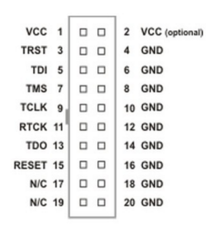
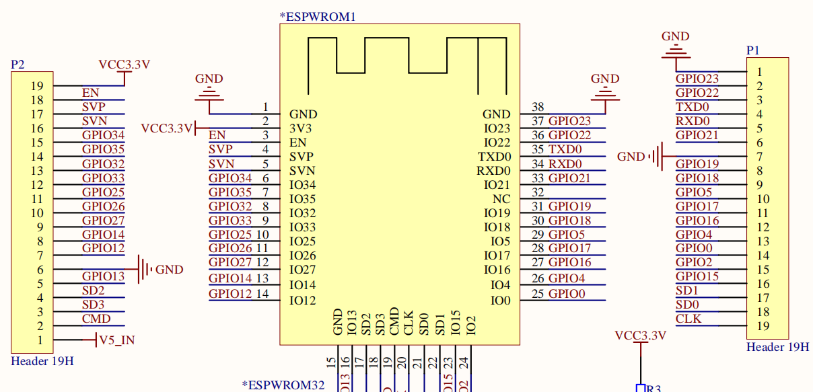

# esp32 goouuu 开发板

## 配置jtag调试

	原理图中的位置    pin名称              JTAG中的pin名称
	P2.12             G33(CHIP_PU)         TRST_N
	P1.16             G15                  TDO
	P2.7              G12                  TDI
	P2.5              G13                  TCK
	P2.8              G14                  TMS
	                  GND                  GND

## error

	esp32 MD5 of file does not match data in flash:
		解决:
			esptool.py read_flash_status
			esptool.py write_flash_status --non-volatile 0

## 在vscode中用gdb openocd调试esp32

	{
		"version": "0.2.0",
		"configurations":
		[
			{
				"type": "gdb",
				"request": "launch",
				"name": "Launch Program",
				"target": "./build/${workspaceFolderBasename}.elf",
				"cwd": "${workspaceFolder}",
				"gdbpath": "C:/msys32/opt/xtensa-esp32-elf/bin/xtensa-esp32-elf-gdb",
				"autorun":
				[
					"target remote :3333",
					"mon reset halt",
					"flushregs",
					"thb app_main",
					"c"
				],
				"preLaunchTask": "openocd"
			}
		]
	}
