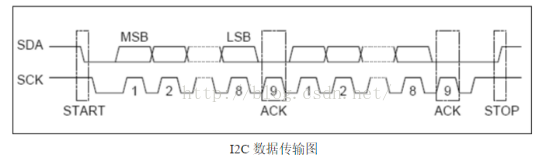

# i2c 笔记

配置数据

启用中断

中断回调
    清除标志位

write操作:

    发送: 偏移地址高位, 偏移地址低位, 数据

## i2c 协议

    开始信号: SCL在高电平期间, 数据线由高变为低
    停止信号: SCL在高电平期间, 数据线由低变为高
    应答信号:
        主机写从机时, 每写完一个字节, 从机在下一个时钟周期将数据线拉低, 以告诉主机操作有效.
        主机读从机时, 每读完一个字节, 主机在下一个时钟周期将数据线拉低, 以告诉从机操作有效, 最后一个字节不发应答，直接发停止信号

    注: 时钟线为高电平期间的数据线上的电平改变都被认为是起始和停止信号，所以数据改变必须要在时钟为低电平时改变

## 基本过程

