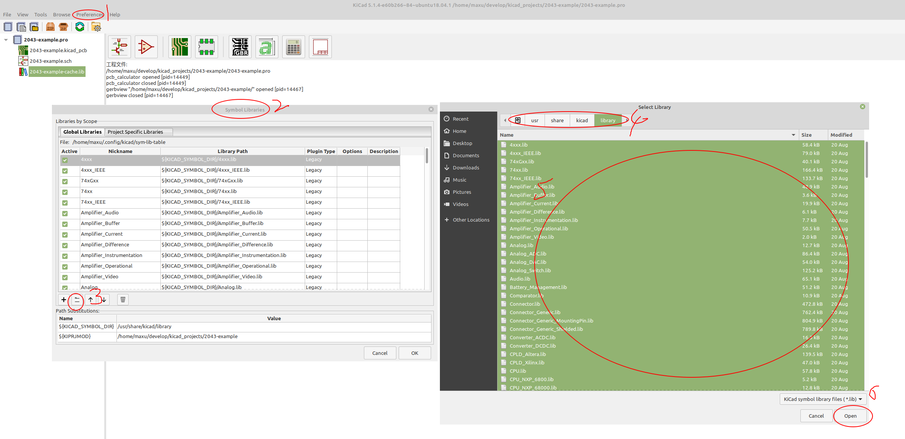
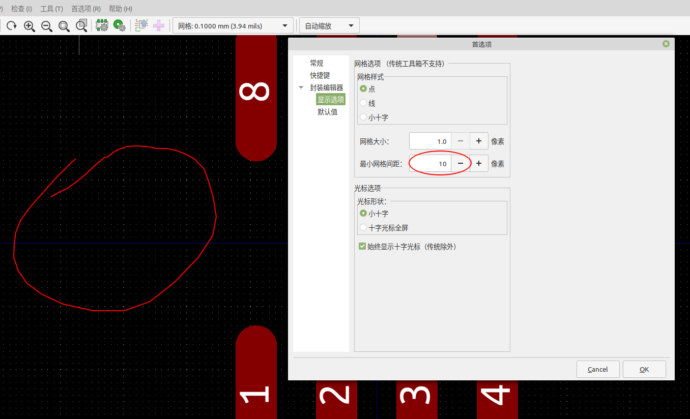

# kicad 学习笔记

## apt安装kicad

sudo add-apt-repository ppa:js-reynaud/kicad-5.1
sudo apt-get update
sudo apt install kicad kicad-locale-zh kicad-doc-zh kicad-demos kicad-symbols kicad-packages3d kicad-templates kicad-footprints kicad-libraries

## source安装kicad

    # python-pip libgtk-3-dev python-wxtools
    sudo apt install libglew-dev libglm-dev libcurl4-openssl-dev libboost-all-dev liboce-ocaf-dev swig libwxgtk3.0-gtk3-dev python-wxgtk3.0-dev libssl-dev doxygen ninja-build

    # pip2 install --user setuptools wxpython

    mkdir -p output/debug
    cd output/debug
    cmake -DCMAKE_BUILD_TYPE=Debug -DKICAD_SCRIPTING=ON -G Ninja ../..

# kicad入门

## 加载符号库

## 设置网格grid
    右击菜单 --> 网格 --> 设置网格，即一个grid的宽度

    如果网格看着太密集，则设置首选项，最小网格间距为100

## 基本用法

    m
    移动，不保持连接

    g
    移动，保持连接

    r
    旋转

    e
    编辑符号属性

    c
    复制

    a
    放置

    w
    放线

    Breakspace
    删除线

    v
    改值

    u
    改参考编号

    x
    x方向镜像

    y
    y方向镜像

    ctrl e
    进入符号编辑器

    复制
    按住shift，选中拖动

    按空格键，就会把光标当前位置作为起始点，移动鼠标后，在下面就可以看到光标相对起始点的位置变化

## 笔记

    符号库编辑：

    ～， 空名称

    ~~, 上划线

    Pitch, 两单元中心间距

    PcbNew:

        F: 翻转

        双击布线无法编辑布线设置:
            首选项: 取消勾选<编辑操作更改布线宽度>

        Paste:      锡膏层
        Dwgs.user:  图形说明层
        Silks:      丝印层
        Edge.Cuts:  电路板边框轮廓

## 元件库

    https://github.com/Digi-Key/digikey-kicad-library.git
