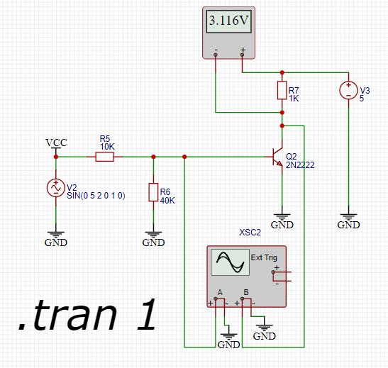

# 电路知识

## 上拉电阻

图1 描述的是一个使用情景: Vt1.c作为下一级的带有输入电阻的输入

图2 把图1中的下一级中输入电阻和基级电阻当做一个5K的电阻

图3 给Vc这个输入信号添加一个5k的上拉电阻

对图2分析:

    如果输入5V的信号, 假设Vt1.b=0.7V, T1处于饱和状态, Vt1.c约为0.3V, 即低电平
    如果输入0V的信号, t1晶体管截止, Vt1.c为12*5/(10+5)=4V, 这个电平既不是高电平, 也不是低电平

对图3分析:

    如果输入5V的信号, 假设Vt1.b=0.7V, T1处于饱和状态, Vt1.c约为0.3V, 即低电平
    如果输入0V的信号, t1晶体管截止, BT1的C与E间电阻很大(视为断路), Rc与Rs的并联电阻为(10*5)/(10+5)k, 即3.33kΩ, Vt1.c为12*5/(3.33+5), 即7.2V, 即高电平

结论: 上拉电阻用于提高输入级的高电平输入电压. 需注意: 上拉电阻产生的电流将灌入T1的集电极, 因此, 上拉电阻对T1来说, 是灌电流负载, 需要考虑发热功耗.

### 下拉电阻

没有下拉电阻时, 按下key能获取到B端的电平, 没有按下时, B端电平不确定

有了下拉电阻后, 按下key能获取到B端的电平, 没有按下时, B端电平为低

如果出现一尖脉冲电平，由于时间比较短，所以这个电压很容易被电阻拉低; 如果高电平的时间比较长，那就不能拉低了，也就是正常高电平时没有影响

## 二极管

### 稳压管

稳压管在反向击穿时, 由于通过其的电流在$i_Z$~$i_{ZM}$间, 端电压几乎不变, 表现为稳压特性.

稳压管的主要参数:

1. 稳定电压 U$_Z$
    在规定电流下稳压管的反向击穿电压. 对某一只管子来说, U$_Z$是确定值
2. 稳定电流 I$_Z$
    I$_Z$是稳压管稳定工作在稳定电压状态时的参考电流, 电流低于此值时效果变坏, 也记作I$_Z$$_{min}$, 最大稳定电流是I$_{ZM}$
3. 额定功耗P$_{ZM}$
    P$_{ZM}$=U$_Z$ * I$_{ZM}$, 稳压管的功耗超过此值时, 会因结温升过高而损坏.
4. 动态电阻
    r$_{z}$=$\Delta U_Z$ / $\Delta I_z$, r$_{z}$: r$_{z}$时稳压管稳定工作时, 端电压变化量与其电流变化量之比, r$_z$越小, 电流变化时电压变化就越小, 稳压管的稳压特性就越好
5. 温度系数$\alpha$
    $\alpha$=$\Delta U_z$/$\Delta t$, 稳定电压在4~7V时, 温度系数近似为0

## 三极管

PN结, p接正极, N接负极, 则为PN结正向偏置或正偏

三极管有三个工作状态: 截止区, 放大区, 饱和区

三极管的作用是信号放大和开关.

简单的技巧:

    三极管上箭头所在方向的二极管, 只要二极管正向导通, 那么三极管上下就能导通。

### NPN

截止区: 当基极的偏置电压小于0.7V时, B极电流为零, CE极无电流流过, 三极管处于不导通状态

放大区: 当基极的偏置电压等于0.7V时, CE极处于半导通状态, CE电流跟随B极电流发生变化, 呈现电流的放大状态

饱和区: 当基极的偏置电压大于0.7V时, CE极电流达到一定程度不再跟随B极电流发生变化, CE极处于导通状态

Ube < 0.5V时已经开始截止了, 但为了可靠, 一般使Ube=0或反偏. 三极管截止时, 集电极处于反向偏置, 这是Ib,Ic,Ie均为0

### NPN放大电路

### NPN三极管开关电路

一个仿真测试:

处于饱和区时, 集电极几乎为0, 图中是0.019V

## 高阻态

## 偏置电路

## 漏电流

## 三极管饱和深度
